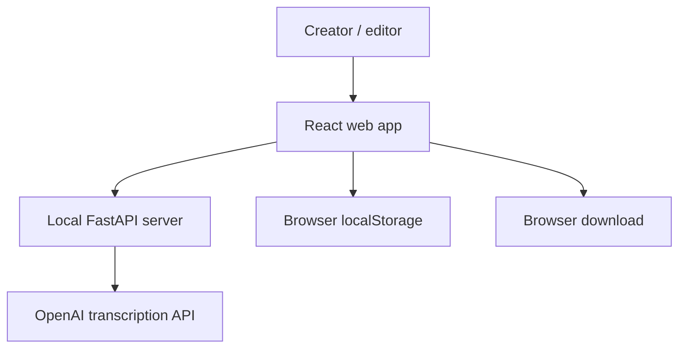

# Architecture Context

## System Context

## Containers Or Major Modules

| Container/Module | Responsibility | Owner | Notes |
| --- | --- | --- | --- |
| Web app | Desktop caption editing UI and controller orchestration | `apps/web` | React + Vite |
| API server | Secret-bearing transcription adapter | `apps/api` | FastAPI; OpenAI key stays server-side |
| Caption domain | Word grouping, timing, SRT export, empty-zone rules | `apps/web/src/domain/captions` | Pure TypeScript domain logic |
| Services | Browser/API adapters for transcription, storage, audio fingerprinting | `apps/web/src/services` | No presentational UI |
| Caption workbench feature | Feature-level orchestration and page composition | `apps/web/src/features/caption-workbench` | Owns current screen workflow |
| Shared UI/components | Presentational components | `apps/web/src/components` | Render props and emit events |

## Data Ownership

| Data | Source of truth | Owner | Notes |
| --- | --- | --- | --- |
| OpenAI API key | `apps/api/.env` | API server | Never exposed to browser |
| Caption words | Transcription response/cache | Caption domain + storage service | Words are source of truth for generated groups |
| Caption groups | Caption domain generation plus user edits | Caption workbench | Provider groups are not trusted as durable editor groups |
| Project autosave | Browser `localStorage` | Storage service | Local-only |
| Source media bytes | Browser `File` object | User browser session | Not persisted by app |

## Integration Points

| Integration | Direction | Purpose | Notes |
| --- | --- | --- | --- |
| OpenAI transcription | API server outbound | Get word-level transcript | Current model is `whisper-1`; long media is chunked server-side before provider calls |
| Browser localStorage | Web app local | Cache transcript/project | Keyed by fingerprint/language |
| Browser File API | Web app local | Upload/play source media | Object URL is revoked on change |
| Browser download | Web app local | Export SRT | No server roundtrip |

## Architecture Assumptions

- Desktop-first UX is acceptable.
- Local-only storage is acceptable for current phase.
- CapCut import starts with SRT until draft rewrite/export format is proven.
- Transcription quality issues must be observable from logs before model or
  alignment changes are added.

## ADRs Needed

- Transcription provider and timestamp strategy.
- CapCut export target format beyond SRT.
- Whether local forced alignment should be introduced after manual text edits.
