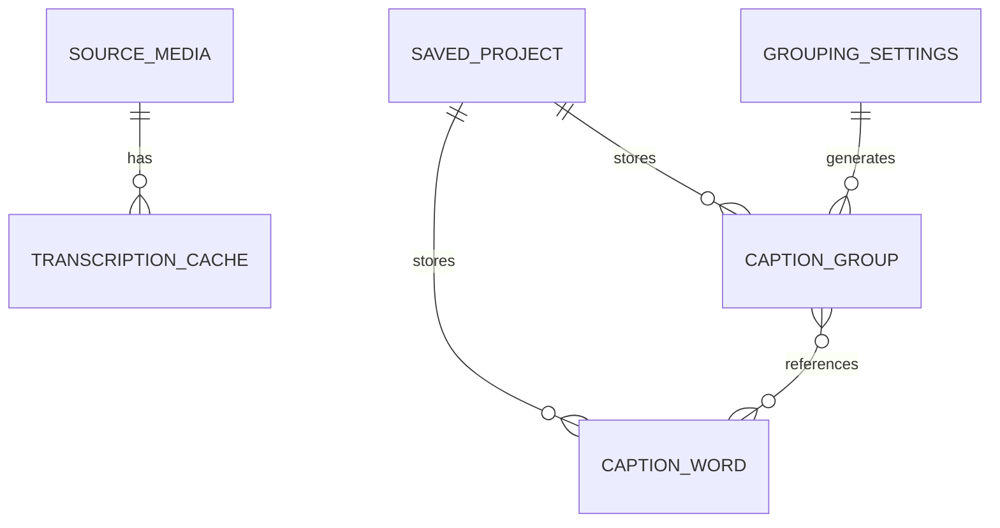

# Domain Model

## Entities

### SourceMedia

- Purpose: User-selected audio or video file used for transcription and playback.
- Key fields: `File`, object URL, duration, audio fingerprint.
- Relationships: Owns zero or one `TranscriptionCache` entry per language.
- Invariants: Fingerprint is derived from file bytes and size.
- Lifecycle/statuses: selected, fingerprinted, cached, transcribed.
- Owned by: Web services/audio and caption workbench feature.

### CaptionWord

- Purpose: Canonical timestamped word from transcription.
- Key fields: `id`, `text`, `start`, `end`, optional `confidence`.
- Relationships: Referenced by `CaptionGroup.wordIds`.
- Invariants: `id` is stable inside one transcription; `start` and `end` are
  seconds on the source media timeline.
- Lifecycle/statuses: received, cached, edited indirectly through grouping.
- Owned by: `apps/web/src/contracts/captions.ts` and caption domain.

### CaptionGroup

- Purpose: Subtitle block displayed and exported to CapCut/SRT.
- Key fields: `id`, `wordIds`, `text`, `textOverride`, `start`, `end`.
- Relationships: Contains one or more `CaptionWord` references.
- Invariants: Groups are ordered by start time; a group end is trimmed to the
  next group start during normalization.
- Lifecycle/statuses: generated, manually split/merged, timing-adjusted,
  exported.
- Owned by: caption domain.

### GroupingSettings

- Purpose: Deterministic caption grouping rules.
- Key fields: `maxWords`, `minDuration`, `maxChars`, `pauseThreshold`,
  `trimEmptyZones`, `emptyZoneThreshold`.
- Relationships: Used to ingest transcription and rebuild caption groups.
- Invariants: Settings are normalized before use.
- Lifecycle/statuses: default, user-adjusted, persisted.
- Owned by: caption domain.

### TranscriptionCache

- Purpose: Browser-local cached transcription for one media fingerprint and
  language.
- Key fields: fingerprint, language, source file metadata, `TranscriptionResult`.
- Relationships: Hydrates `SavedProject` and caption editor state.
- Invariants: Cache key includes language and fingerprint.
- Lifecycle/statuses: missing, available, overwritten by fresh transcription.
- Owned by: storage service.

### SavedProject

- Purpose: Browser-local editor state.
- Key fields: source metadata, language, words, groups, grouping settings.
- Relationships: Restored on boot and autosaved after editor state changes.
- Invariants: Does not contain server secrets or raw API credentials.
- Lifecycle/statuses: restored, autosaved, manually saved, exported.
- Owned by: storage service.

## Relationships

## Invariants

- Caption words are the source of truth for generated groups.
- Provider-returned groups are never the durable grouping source; the editor
  rebuilds groups from words through the caption domain.
- Manual group timing edits may update adjacent group boundaries but must not
  silently mutate word timestamps.
- Non-final groups do not overlap the next group after normalization.
- Browser storage is local-only and must not contain OpenAI API keys.

## Open Questions

- Which non-SRT CapCut draft format should be exported for direct caption import?
- Should transcription move from `whisper-1` to a newer timestamp model or a
  local forced-alignment backend?
- Should cache invalidation include transcription model/version once model
  selection becomes configurable?
