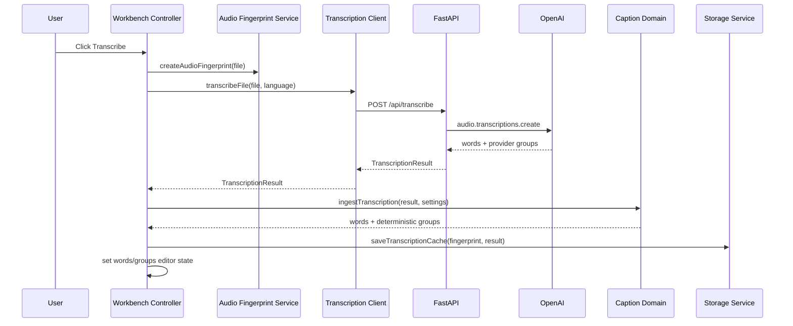
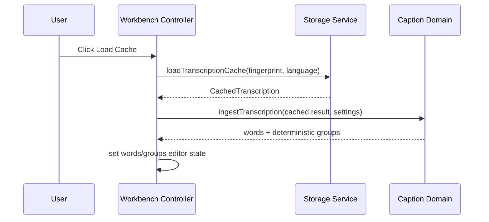

# Runtime View

## Fresh Transcription

```mermaid
sequenceDiagram
    participant U as User
    participant W as Workbench Controller
    participant A as Audio Fingerprint Service
    participant T as Transcription Client
    participant API as FastAPI
    participant O as OpenAI
    participant D as Caption Domain
    participant S as Storage Service

    U->>W: Click Transcribe
    W->>A: createAudioFingerprint(file)
    W->>T: transcribeFile(file, language)
    T->>API: POST /api/transcribe
    API->>O: audio.transcriptions.create
    O-->>API: words + provider groups
    API-->>T: TranscriptionResult
    T-->>W: TranscriptionResult
    W->>D: ingestTranscription(result, settings)
    D-->>W: words + deterministic groups
    W->>S: saveTranscriptionCache(fingerprint, result)
    W->>W: set words/groups editor state
```

## Cache Load

```mermaid
sequenceDiagram
    participant U as User
    participant W as Workbench Controller
    participant S as Storage Service
    participant D as Caption Domain

    U->>W: Click Load Cache
    W->>S: loadTranscriptionCache(fingerprint, language)
    S-->>W: CachedTranscription
    W->>D: ingestTranscription(cached.result, settings)
    D-->>W: words + deterministic groups
    W->>W: set words/groups editor state
```
